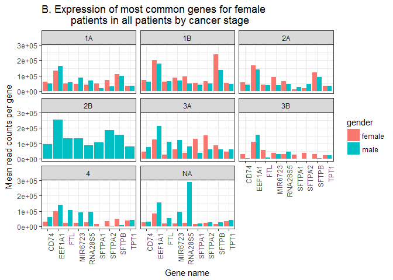

Analysis Report 2: Your Title Here
================
Emma Gibson
November 20, 2017

Introduction
============

Add about 1 page here. Must cite at least 5 peer reviewed articles.

Methods
=======

Sample origin and sequencing
----------------------------

Add about half a page here. In this section instead of first person (I/we), use Li et al. (Li *et al.*, 2015) and Seo et al. (Seo *et al.*, 2012), since you'll just be describing what they did, based on the methods in their paper(s). It's important to include this so the reader knows what the study design was for the data you will be presenting.

Computational
-------------

These are the methods that were used to process the sequencing data. Should probably be at least a half of a page. At a very minimum should include citations for biomartr, trimmomatic, and sailfish. Note that these three methods references don't count towards the five references you need to cite in the introduction.

Results
=======

In addition to a minimum of 4-5 figures/tables (and associated captions), you should include sufficient text in this section to describe what your findings were. Remember that in the results section you just describe what you found, but you don't interpret it - that happens in the discussion.

| gender | genename |  mean\_count|
|:-------|:---------|------------:|
| male   | EEF1A1   |    183911.87|
| female | EEF1A1   |    149021.94|
| female | SFTPB    |    135305.42|
| male   | SFTPB    |    105009.56|
| male   | MIR6723  |     91501.45|
| male   | FTL      |     77787.92|
| male   | RNA28S5  |     71265.16|
| female | SFTPA2   |     66520.77|
| male   | FN1      |     65454.33|
| male   | CD74     |     63047.61|
| male   | SFTPA2   |     60627.62|
| female | CD74     |     58994.05|
| female | MIR6723  |     58916.57|
| female | RNA28S5  |     58079.55|
| male   | FTH1     |     52390.78|

**Table 1**: The most highly expressed genes in both genders included *SFTPB* and *EEF1A1*.


This figure shows the fifteen most common genes in male and female patients.


**Figure x**: Here we show another example figure caption.

``` r
# first, this code finds various factors for each patient
gender_and_smoking_status <- final_table %>%
  group_by(smoking_status, cancer_stage, gender, sample_name_s) %>%
  count() %>%
  arrange(desc(n))

#next, this code interprets it as a dataframe and reads it into ggplot
with(gender_and_smoking_status, table(gender, smoking_status, cancer_stage)) %>%
  as.data.frame() %>% #to make it a ggplot-friendly dataframe
  ggplot(aes(x = smoking_status,
             y = Freq,
             fill = gender)) +
  facet_wrap(~cancer_stage) +
  geom_col(position = "dodge") +
  ggtitle("Smoking status of patients with each cancer stage") +
  xlab("Smoking status") +
  ylab("Number of patients") +
  theme_bw() +
  theme(axis.text.x =
            element_text(angle = 90,
                         hjust = 1))
```


``` r
# this code finds the top 9 genes in female patients only
# I chose 9 instead of 15 because the original top 15 had
# 9 genes because some were common in both genders
top_9_f <- final_table %>%
  filter(gender == "female") %>%
  group_by(genename) %>%
  summarize(mean_count = mean(counts_lengthscaledtpm)) %>%
  arrange(desc(mean_count)) %>%
  head(n = 9)

#next, this line puts it into a nice markdown table
kable(top_9_f)
```

| genename |  mean\_count|
|:---------|------------:|
| EEF1A1   |    149021.94|
| SFTPB    |    135305.42|
| SFTPA2   |     66520.77|
| CD74     |     58994.05|
| MIR6723  |     58916.57|
| RNA28S5  |     58079.55|
| FTL      |     51200.27|
| SFTPA1   |     50997.97|
| TPT1     |     40372.54|

``` r
# this puts the top 9 female genes into a facet-friendly format
top_genes_f <- top_9_f %>%
  ungroup() %>%
  select(genename) %>%
  unique() %>%
  pull()

# this code makes a figure similar to Figure 2, but with top female genes
# it doesn't plot top_genes_f because I wanted to include male patients
final_table %>%
  filter(genename %in% top_genes_f) %>%
  ggplot(aes(x = genename,
             y = counts_lengthscaledtpm,
             fill = gender)) +
    geom_boxplot() +
    facet_wrap(~smoking_status) +
    xlab("Gene name") +
    ylab("Scaled read counts per gene") +
    ggtitle("Read counts per gene of genes common to female smokers") +
  theme_bw() +
  theme(axis.text.x =
            element_text(angle = 90,
                         hjust = 1))
```


``` r
# this gets the appropriate metadata to make a figure faceted by smoking status
top_f_in_all_status <- final_table %>%
  filter(genename %in% top_genes_f) %>%
  group_by(gender, genename, smoking_status) %>%
  summarize(mean_count = mean(counts_lengthscaledtpm))

top_f_in_all_status %>%
  ggplot(aes(x = genename,
             y = mean_count,
             fill = gender)) +
  facet_wrap(~smoking_status) +
  geom_col(position = "dodge") +
  ggtitle("Expression of most common genes in female
          patients in all patients by smoking status") +
  xlab("Gene name") +
  ylab("Mean read counts per gene") +
  theme_bw() +
  theme(axis.text.x =
            element_text(angle = 90,
                         hjust = 1))
```


``` r
# this gets the appropriate metadata to make a figure faceted by cancer stage
top_f_in_all_stage <- final_table %>%
  filter(genename %in% top_genes_f) %>%
  group_by(gender, genename, cancer_stage) %>%
  summarize(mean_count = mean(counts_lengthscaledtpm))

top_f_in_all_stage %>%
  ggplot(aes(x = genename,
             y = mean_count,
             fill = gender)) +
  facet_wrap(~cancer_stage) +
  geom_col(position = "dodge") +
  ggtitle("Expression of most common genes in female
          patients in all patients by cancer stage") +
  xlab("Gene name") +
  ylab("Mean read counts per gene") +
  theme_bw() +
  theme(axis.text.x =
            element_text(angle = 90,
                         hjust = 1))
```



Discussion
==========

-SFTPB is more common in never-smoking females, and in males otherwise - this comes mostly from 1B stage patients - this stage is also common in previously-smoking males, who show much higher SFTPB - this indicates it's probably due to cancer stage rather than smoking status

-it lookslike females have different smoking status/stage -see if there are genes more common to females than males -compare to males of same cancer stage -are these genes due to female smoking status? Or are they differently expressed in males

Add around 1-2 pages interpreting your results and considering future directions one might take in analyzing these data.

Sources Cited
=============

Li,Y. *et al.* (2015) RNA-seq analysis of lung adenocarcinomas reveals different gene expression profiles between smoking and nonsmoking patients. *Tumor Biology*, **36**, 8993–9003.

Seo,J.-S. *et al.* (2012) The transcriptional landscape and mutational profile of lung adenocarcinoma. *Genome research*, **22**, 2109–2119.
